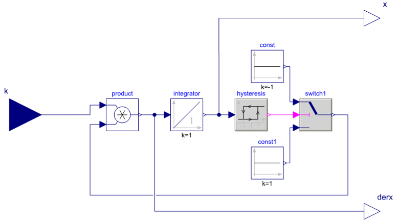
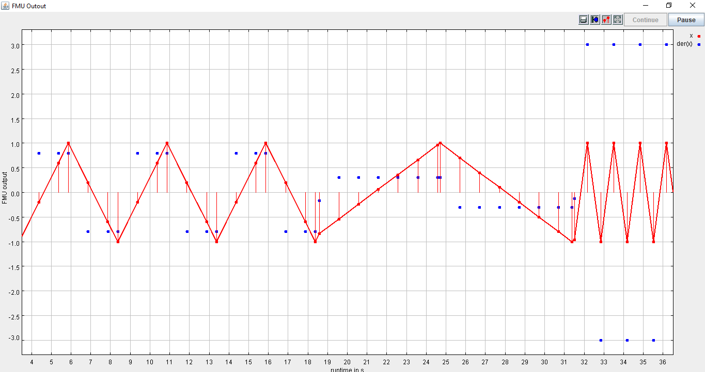
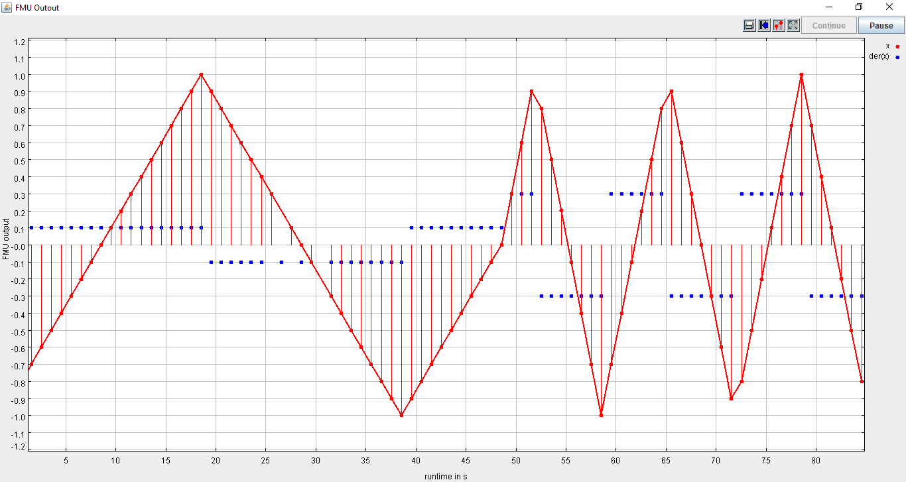

Prerequisites
=============

Required Lablink resources
--------------------------

The following Lablink resources are required for running the examples:

* `Configuration Server <https://ait-lablink.readthedocs.io/projects/lablink-config-server>`__: *config-0.0.1-jar-with-dependencies.jar*
* `Datapoint Bridge <https://ait-lablink.readthedocs.io/projects/lablink-datapoint-bridge>`__: *dpbridge-0.0.1-jar-with-dependencies.jar*
* `Lablink Plotter <https://ait-lablink.readthedocs.io/projects/lablink-plotter>`__: *plotter-0.0.1-jar-with-dependencies*

When :doc:`building from source <installation>`, the corresponding JAR files will be copied to directory *target/dependency*.

.. note:: You also need a **local copy** of the FMU file :github_blob:`zigzag.fmu <src/test/resources/zigzag.fmu>`.
  In case you have checked out a local copy of the `lablink-fmusim repository <https://github.com/AIT-Lablink/lablink-fmusim>`__, you can find it in the local subdirectory *src/test/resources*.

Starting the configuration server
---------------------------------

Start the configuration server by executing script :github_blob:`run_config.cmd <examples/0_config/run_config.cmd>` in subdirectory :github_tree:`examples/0_config`.
This will make the content of database file *test-config.db* available via http://localhost:10101.

.. note:: Once the server is running, you can view the available configurations in a web browser via http://localhost:10101.

.. seealso: A convenient tool for viewing the content of the database file (and editing it for experimenting with the examples) is `DB Browser for SQLite <https://sqlitebrowser.org/>`_.

Example 1: Dynamic simulation using an FMU for Model Exchange
=============================================================

The figure below shows the graphical representation of the *zigzag* model used in this example.
It comprises an integrator, whose input is a constant (model input variable ``k``), and a hysteresis controller, which switches the sign of ``k`` in case the integrator's output variable ``x`` crosses a certain threshold (low: -1, high: 1).
The resulting output is a zigzag pattern (hence the model name).
The model has been compiled with `Dymola <https://en.wikipedia.org/wiki/Dymola>`__ into an FMU for Model Exchange, which can be found in subdirectory :github_tree:`src/test/resources`.

To run the example, edit attribute ``FMU.URI`` in the FMU simulator client configuration ``ait.test.fmusim.dynamic_me.fmu.config`` to match the absolut path of the FMU file (located in your local subdirectory *src/test/resources*).
Use for instance `DB Browser for SQLite <https://sqlitebrowser.org/>`__ to edit the configuration.

All relevant scripts can be found in subdirectory :github_tree:`examples/1_dynamic_me`.
To run the example, execute all scripts either in separate command prompt windows or by double-clicking:

* :github_blob:`fmusim.cmd <examples/1_dynamic_me/fmusim.cmd>`: runs the FMU simulator
* :github_blob:`dpb.cmd <examples/1_dynamic_me/dpb.cmd>`: runs the datapoint bridge service, connecting the FMU simulator and the plotter
* :github_blob:`plot.cmd <examples/1_dynamic_me/plot.cmd>`: runs the plotter, which will plot incoming data

.. note:: The order in which the scripts are started is arbitrary.

Once the FMU simulator client starts up, the client shell can be used to interact with the FMU model.
For instance, input variable ``k`` of the FMU model can be changed:

.. code-block:: doscon

   llclient> svd k .3
   Success
   llclient> svd k 3
   Success

An example of how the FMU reacts on these inputs can be seen in the following figure.

Example 2: Fixed-step simulation using an FMU for Model Exchange
================================================================

This example uses the same *zigzag* model as the previous example.

To run the example, edit attribute ``FMU.URI`` in the FMU simulator client configuration ``ait.test.fmusim.fixedstep_me.fmu.config`` to match the absolut path of the FMU file (located in your local subdirectory *src/test/resources*).
Use for instance `DB Browser for SQLite <https://sqlitebrowser.org/>`__ to edit the configuration.

All relevant scripts can be found in subdirectory :github_tree:`examples/2_fixedstep_me`.
To run the example, execute all scripts either in separate command prompt windows or by double-clicking:

* :github_blob:`fmusim.cmd <examples/2_fixedstep_me/fmusim.cmd>`: runs the FMU simulator
* :github_blob:`dpb.cmd <examples/2_fixedstep_me/dpb.cmd>`: runs the data point bridge service, connecting the FMU simulator and the plotter
* :github_blob:`plot.cmd <examples/2_fixedstep_me/plot.cmd>`: runs the plotter, which will plot incoming data

.. note:: The order in which the scripts are started is arbitrary.

Once the FMU simulator client starts up, the client shell can be used to interact with the FMU model.
For instance, input variable ``k`` of the FMU model can be changed:

.. code-block:: doscon

   llclient> svd k 0.3
   Success

An example of how the FMU reacts on these inputs can be seen in the following figure.
Notice the differences to the previous example, where the FMU simulator did update the outputs not only at strictly periodic intervals.

