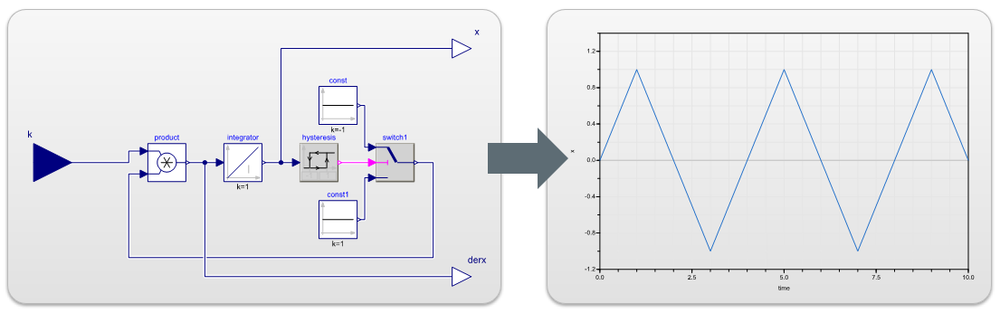

*************************
AIT Lablink FMU Simulator
*************************

.. meta::
   :description lang=en: AIT Lablink plotter

This package provides Lablink clients that can import and execute Functional Mock-up Units (FMUs), i.e., co-simulation components compliant to the `Functional Mock-up Interface (FMI) <https://fmi-standard.org/>`_.
The clients in this package rely on functionality provided by the `FMI++ Library <http://fmipp.sourceforge.net>`_.

Because FMUs may implement different features (model exchange and/or co-simulation) and because FMUs can be used in various synchronization schemes, this package provides several types of **FMU simulators**.
Each FMU simulator has a different approach for synchronization (fixed step, discrete event, etc.) and its usefullness for any application depends highly on the specific requirements (especially the synchronization schedule).

The following FMU simulators are provided by this package:

* **DynamicFmuModelExchangeAsync**:
  This client simulates FMUs for Model Exchange and synchronizes them periodically to real time.
  At each synchronization point the client updates its output ports according to the selected FMU model ouput variables.
  In case an (internal) event is detected during the integration of the FMU model, the periodic synchronization schedule is adapted such that the output ports are updated at the corresponding event time.
  New inputs to the client are treated as (external) events and the integration of the FMU model and the synchronization schedule is adapted accordingly.
  *This FMU simulator is specifically suitable for discrete event simulations, where inputs are not periodical and/or internal events of the model are of special interest.*
* **FixedStepFmuModelExchangeAsync**: 
  This client simulates FMUs for Model Exchange and synchronizes them strictly periodically to real time.
  Inputs to the model are delayed to the next synchronization point.
  In case an (internal) event is detected during the integration of the FMU model, the event is handled properly, but the outputs of the client are not updated.
  *This FMU simulator is specifically suitable for fixed-step simulations, where inputs and/or outputs of the model are periodical.*
   

Installation
============

Find information about the installation of the Lablink FMU simulator clients :doc:`here <installation>`.

.. toctree::
   :maxdepth: 2
   :hidden:
   :caption: Installation

   /installation
   
Running the clients
===================

Find basic instructions for running the clients :doc:`here <running>`.

.. toctree::
   :maxdepth: 2
   :hidden:
   :caption: Running the clients

   /running

Configuration
=============

Find the reference for writing a configuration for a Lablink FMU simulator client :doc:`here <configuration>`.

.. toctree::
   :maxdepth: 2
   :hidden:
   :caption: Configuration

   /configuration

Examples
========

Find step-by-step instructions for running the examples :doc:`here <examples>`.

.. toctree::
   :maxdepth: 2
   :hidden:
   :caption: Examples

   /examples
